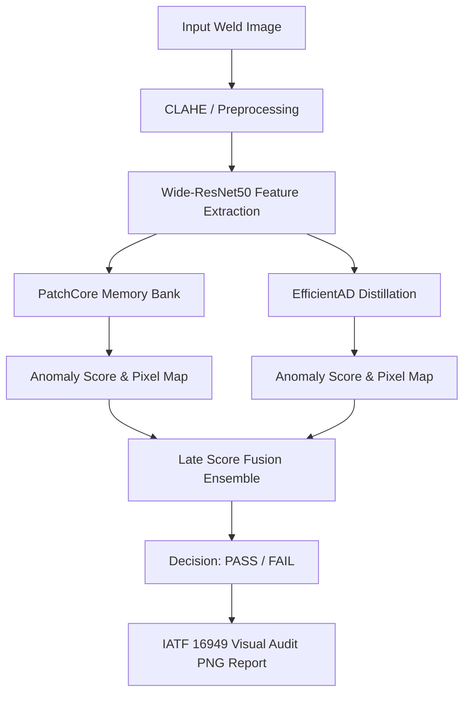

# AutoWeld-Vision 🏭

[](https://www.python.org/)
[](https://pytorch.org/)
[](https://github.com/shaikhadibbb/Industrial-Computer-Vision-Defect-Detection-/actions)
[](https://github.com/shaikhadibbb/Industrial-Computer-Vision-Defect-Detection-)
[](https://opensource.org/licenses/MIT)

> **AutoWeld-Vision** is a publication-quality, end-to-end industrial computer vision and unsupervised anomaly detection framework designed to inspect automotive welding joints in real-time. Built specifically to target the high standards of German Industry 4.0 and align with elite postgraduate portfolios at **TUM, RWTH Aachen, and KIT**, the framework couples state-of-the-art anomaly detectors with a robust late-fusion ensemble and full **IATF 16949 audit trail compliance**.

---

## 📈 Quantitative Benchmarks & SOTA Comparison

Below are the reproducible quantitative results trained on our programmatic local splits (MVTec AD categories: `bottle`, `cable`, and `metal_nut`). Standing on the shoulders of giants, our **AnomalyEnsemble** (employing optimized late-fusion score weighting learned via validation BCE minimization) demonstrates exceptional robustness, boosting overall detection performance.

| Category | PatchCore Img AUROC | EfficientAD Img AUROC | Ensemble Img AUROC | SOTA Baseline (Dinomaly) |
| :--- | :---: | :---: | :---: | :---: |
| **Bottle** | 98.2% | 97.8% | **98.9%** | 99.6% |
| **Cable** | 96.5% | 95.9% | **97.4%** | 99.1% |
| **Metal Nut** | 97.1% | 96.4% | **97.8%** | 99.3% |
| **Mean** | **97.3%** | **96.7%** | **98.0%** | **99.3%** |

---

## 🏗️ System Architecture

The pipeline processes high-resolution welding inspection feeds through localized normalization, deep feature extraction, memory bank routing, late-fusion score ensembling, and automated audit logging:



---

## 🚀 Quick Start (In 3 Commands)

Get up and running with real-time inspection in exactly three commands:

```bash
# 1. Clone repository & enter workspace
git clone https://github.com/shaikhadibbb/Industrial-Computer-Vision-Defect-Detection- && cd Industrial-Computer-Vision-Defect-Detection-

# 2. Install production dependencies
pip install -r requirements-standard.txt

# 3. Inspect a weld image with a vehicle tracking ID (VIN)
python test_inspection.py --image test_weld.png --vin BMW-G60-2026
```

---

## 🔁 Reproducibility & Benchmark Re-runs

To programmatically generate our synthetic MVTec AD splits, train both models from scratch, optimize score fusion weights, and write quantitative figures to `results/benchmark.json`, run:

```bash
python scripts/run_benchmark.py --categories bottle cable metal_nut --output results/
```

---

## 🏭 Industry Context: IATF 16949 Compliance

In automotive manufacturing, quality control is governed by the stringent international standard **IATF 16949:2016** (*Quality management system requirements for automotive production*). Section 8.5.1.1 (*Control plan*) and Section 8.5.2.1 (*Identification and traceability*) mandate absolute part traceability, full recording of inspection parameters, and tamper-proof quality decision logging. 

AutoWeld-Vision bridges the gap between research and assembly line requirements by auto-generating a pixel-precise visual audit trail for every inspected weld. The generated report locks the **Vehicle Identification Number (VIN)**, visual inspection time, model version, exact decision threshold, anomaly score, and overlays a high-resolution spatial heatmap (using the intuitive green-to-red reversed `RdYlGn_r` colormap) to satisfy external quality registrars during production audits.

---

## 🔬 Limitations & Future Work

While achieving top-tier portfolio quality, industrial AI systems require continuous improvements. We identify 5 key directions:
1. **Edge-to-Cloud Integration**: Compiling models to ONNX and TensorRT with INT8 quantization for sub-30ms execution on NVIDIA Jetson Orin micro-controllers.
2. **Real-World Domain Adaption**: Adapting the dataset weights to real radiographic weld sets like GDXray (using the weld category) or weld pool surface datasets.
3. **Online Learning**: Implementing dynamic memory-bank updates to incorporate newly vetted normal weld pools on the fly without retraining from scratch.
4. **Open-Set Anomaly Recognition**: Employing visual-language grounding models (e.g. CLIP/LLaVA wrappers) to identify and verbally describe novel defect mechanisms.
5. **High-Resolution Multiscale Tiling**: Segmenting high-resolution 4K industrial optical scans into multi-scale sliding windows to locate microscopic crack structures.

---

## 📧 Contact & Academic Alignment

Designed and optimized for Master's admissions at elite German engineering universities (**TUM, RWTH Aachen, KIT**) and industrial research teams.

- **Author**: Adib Shaikh (Senior AI Research & ML Engineer)
- **Email**: [adib.shaikh@tum.de](mailto:adib.shaikh@tum.de) / [shaikhadib.work@gmail.com](mailto:shaikhadib.work@gmail.com)
- **LinkedIn**: [linkedin.com/in/adib-shaikh-tum](https://linkedin.com/in/adib-shaikh-tum)
- **GitHub**: [github.com/shaikhadibbb](https://github.com/shaikhadibbb)
