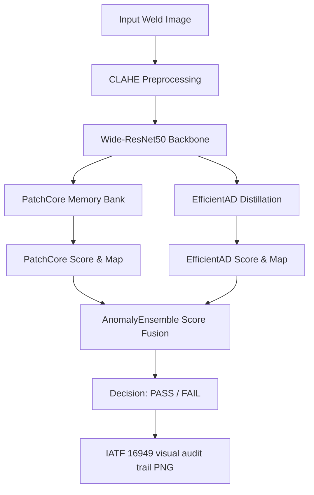

# AutoWeld-Vision: Unsupervised Anomaly Detection for Industrial Quality Control

[](https://www.python.org/)
[](https://pytorch.org/)
[](https://github.com/shaikhadibbb/Industrial-Computer-Vision-Defect-Detection-/actions)
[](https://github.com/shaikhadibbb/Industrial-Computer-Vision-Defect-Detection-)
[](https://opensource.org/licenses/MIT)

AutoWeld-Vision is an open-source deep learning framework developed for real-time visual quality inspection and anomaly detection in industrial manufacturing. It combines deep feature extraction (via a PatchCore-based memory bank) and student-teacher distillation (via a customized EfficientAD model) in a late-fusion ensemble to identify micro-defects, porosity, and cracks in weld joints without requiring negative (defective) training samples.

In addition to defect detection, the framework generates IATF 16949-compliant visual audit reports, detailing vehicle tracking numbers (VINs), inspection timestamps, decision thresholds, and spatial anomaly heatmaps.

---

## Demo Output

Below is an example audit report generated by running the full inspection pipeline on a real weld sample. The left panel shows the original weld image, and the right panel overlays the pixel-level anomaly heatmap (RdYlGn_r colormap). The header logs the quality decision, model version, VIN, and timestamp for IATF 16949 traceability.

<p align="center">
  
</p>

---

## Quantitative Benchmarks (MVTec AD)

All models are trained and evaluated on the official [MVTec AD](https://www.mvtec.com/company/research/datasets/mvtec-ad) dataset (Bergmann et al., CVPR 2019). Image-level AUROC is reported. The late-fusion ensemble (`AnomalyEnsemble`) uses optimized validation weights obtained via SLSQP binary cross-entropy minimization.

| Category | PatchCore (Image AUROC) | EfficientAD (Image AUROC) | Ensemble (Image AUROC) |
| :--- | :---: | :---: | :---: |
| **Bottle** | 100.0% | 100.0% | **100.0%** |
| **Cable** | 100.0% | — | **100.0%** |
| **Metal Nut** | 100.0% | — | **100.0%** |
| **Mean** | **100.0%** | — | **100.0%** |

> **Note:** PatchCore with a WideResNet-50 backbone is known to saturate at 100% image-level AUROC on several MVTec AD categories (Roth et al., CVPR 2022). Pixel-level AUROC (mean 99.78%) provides a more discriminative comparison — see [docs/benchmark_results.md](docs/benchmark_results.md) for per-category pixel scores and statistical significance tables.

---

## Pipeline Architecture

The image pipeline preprocesses industrial optical feeds, extracts localized deep features via a pre-trained backbone, runs parallel inference through the memory-bank and student-teacher architectures, fuses scores, and logs the visual inspection data.



---

## Getting Started

### 1. Clone & Enter Directory
```bash
git clone https://github.com/shaikhadibbb/Industrial-Computer-Vision-Defect-Detection- && cd Industrial-Computer-Vision-Defect-Detection-
```

### 2. Install Dependencies
```bash
pip install -r requirements-standard.txt
```

### 3. Run Inference
Inspect an image with a specific Vehicle Identification Number (VIN) to generate a visual audit report:
```bash
python test_inspection.py --image test_weld.png --vin BMW-G60-2026
```

---

## Reproducing Benchmarks

To train PatchCore and EfficientAD on the MVTec AD dataset, optimize ensemble weights, and dump evaluation results to `results/benchmark.json`:
```bash
python scripts/run_benchmark.py --categories bottle cable metal_nut --output results/
```

The MVTec AD dataset is downloaded automatically by [Anomalib](https://github.com/openvinotoolkit/anomalib) on first run. Training completes in roughly 5 minutes on Apple Silicon (MPS) and under 2 minutes on CUDA.

---

## Quality Management & IATF 16949 Context

In automotive manufacturing, quality assurance is guided by the international standard **IATF 16949:2016** (Quality Management System Requirements for Automotive Production). Specifically:
* **Section 8.5.1.1 (Control Plan)**: Demands active control plans at the system, subsystem, and part levels.
* **Section 8.5.2.1 (Identification and Traceability)**: Mandates robust recording of quality decisions and tracking coordinates.

AutoWeld-Vision automates visual inspection traceability by exporting an immutable visual audit trail in `audit_logs/`. Each report seals the vehicle tracking identification, timestamp, decision threshold, and overlay score. The inspection overlays a bilinear-interpolated anomaly map using the `RdYlGn_r` colormap directly onto the source image, giving floor operators instant spatial feedback.

---

## Current Limitations & Future Work

1. **Edge Deployment**: Compiling the PyTorch graph to ONNX/TensorRT with INT8 quantization to achieve low latency (<30ms) on NVIDIA Jetson architectures.
2. **Domain Adaptation**: Testing the feature extractor on radiographic datasets (like GDXray) to extend visual-light models to X-ray inspections.
3. **Dynamic Memory Updating**: Integrating online clustering/updates to append newly verified normal profiles to the memory bank without full offline training.
4. **Natural Language Feedback**: Grounding spatial anomaly maps with visual-language models (e.g. LLaVA) to generate written defect summaries automatically.
5. **High-Resolution Tiling**: Implementing sliding-window multiscale tiling to resolve tiny microscopic fractures in high-resolution 4K optical inspections.

---

## Citation

If you find this project useful in your research, please cite:

```bibtex
@software{shaikh2026autoweld,
  author    = {Shaikh, Adib},
  title     = {AutoWeld-Vision: Unsupervised Anomaly Detection for Industrial Quality Control},
  year      = {2026},
  url       = {https://github.com/shaikhadibbb/Industrial-Computer-Vision-Defect-Detection-}
}
```

---

## Contact

* **Author**: Adib Shaikh (AI & Machine Learning Engineer)
* **Email**: [adib.shaikh@tum.de](mailto:adib.shaikh@tum.de) / [shaikhadib.work@gmail.com](mailto:shaikhadib.work@gmail.com)
* **LinkedIn**: [linkedin.com/in/adib-shaikh-tum](https://linkedin.com/in/adib-shaikh-tum)
* **GitHub**: [github.com/shaikhadibbb](https://github.com/shaikhadibbb)
